```mermaid
gantt
    title Test
    todayMarker off
    dateFormat  X
    axisFormat %s

    section 19062
    71   : 0, 71

    section 19061
    70   : 0, 70

    section 19401
    36   : 0, 36

    section 7089
    36   : 0, 36
    
    section 193
    34   : 0, 34
 
    section 7441
    9   : 0, 9
    
    section 1148
    8   : 0, 8

    section 1300
    5   : 0, 5

    section 1411
    2   : 0, 2
    
    section 1701
    1   : 0, 1
```

|	 git_number	|	 git_url	|	 git_title	|	 git_assignees	|	 git_created	|	 git_last_updated	|	 git_last_updated_by_owner	|	days_since_last_update_by_owner	|	 git_last_comment	|
|	---	|	---	|	---	|	---	|	---	|	---	|	---	|	---	|	---	|
|	19062	|	 "https://github.abc.com/aaa/bbb/issues/19062"	|	 "Alerts or re*****"	|	 ga****	|	 17-01-2023	|	 29-03-2023	|	 17-01-2023	|	71	|	 "ag****: Hi Jo**& To**. are we able to ..."	|
|	19061	|	 "https://github.abc.com/aaa/bbb/issues/19061"	|	 "Add runbook for *****."	|	 ga*****	|	 17-01-2023	|	 29-03-2023	|	 17-01-2023	|	71	|	 "ag****: Hi To**. Are we able to **** "	|
|	19070	|	 "https://github.abc.com/aaa/bbb/issues/19070"	|	 "Update the tug*****"	|	 Jo*****	|	 18-01-2023	|	 29-03-2023	|	 18-01-2023	|	70	|	 "ag****: Hey Jo**. just wondering if there are *****"	|
|	19401	|	 "https://github.abc.com/aaa/bbb/issues/19401"	|	 "Update the de*****"	|	 ga*****	|	 21-02-2023	|	 29-03-2023	|	 21-02-2023	|	36	|	 "ag****: Hi To**. are they any ***** "	|
|	7089	|	 "https://github.abc.com/aaa/bbb/issues/7089"	|	 "RCA image ***"	|	 sri******	|	 29-11-2022	|	 29-03-2023	|	 21-02-2023	|	36	|	 "ag****: Hi Sr***. are we able to provide ***** "	|
|	193	|	 "https://github.abc.com/aaa/bbb/issues/193"	|	 "Tugboat up***"	|	 Jo***** Jos******	|	 08-02-2023	|	 29-03-2023	|	 23-02-2023	|	34	|	 "ag****: Update from @aw**** part of 193 is  *****"	|
|	7441	|	 "https://github.abc.com/aaa/bbb/issues/7441"	|	 "Vuln ma*****s"	|	 epr***** sri******	|	 16-12-2022	|	 29-03-2023	|	 20-03-2023	|	9	|	 "ag****: @sri*** @ep*** Is there any *****"	|
|	1148	|	 "https://github.abc.com/aaa/bbb/issues/1148"	|	 "Create monitoring*****"	|	 co***** aw***** ep*****	|	 10-01-2023	|	 21-03-2023	|	 21-03-2023	|	8	|	 "ep****: - Maintain a dashboard *****"	|
|	1300	|	 "https://github.abc.com/aaa/bbb/issues/1300"	|	 "Investigate opp*****"	|	 Kar*****	|	 17-01-2023	|	 24-03-2023	|	 24-03-2023	|	5	|	 "Kar**: Slack discussion - *****"	|
|	1411	|	 "https://github.abc.com/aaa/bbb/issues/1411"	|	 "Automated check to *****"	|	 EL*****	|	 10-03-2023	|	 27-03-2023	|	 27-03-2023	|	2	|	 "EL*****: The automation that *****"	|
|	1701	|	 "https://github.abc.com/aaa/bbb/issues/1701"	|	 "Automation handle *****"	|	 CU*****	|	 13-03-2023	|	 28-03-2023	|	 28-03-2023	|	1	|	 "CU*****: @Ze*** Yes please. please put a *****"	|
