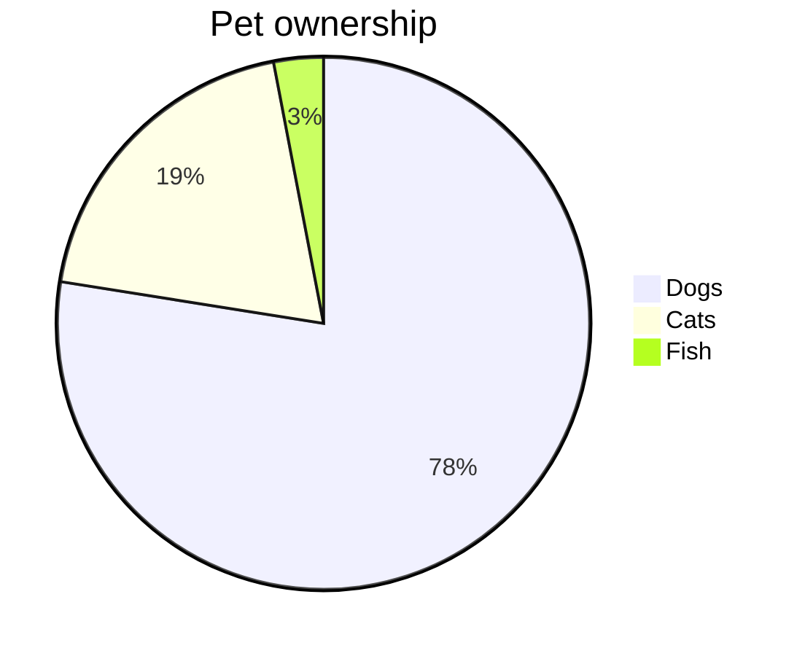

## Pie chart

```mermaid
pie 
  title Pet ownership
  "Dogs" : 386
  "Cats" : 97
  "Fish" : 15
```

```mermaid
gantt
    title Throughput Linux x64 (Total requests) 
    todayMarker off
    dateFormat  X
    axisFormat %s

    section Baseline
    This PR (3781) (6.170M)   : 0, 6170460
    master (5.970M)   : 0, 5969974
    benchmarks/2.23.0 (6.211M)   : 0, 6211402
    benchmarks/2.9.0 (6.225M)   : 0, 6224510

    section Automatic
    This PR (3781) (4.134M)   : 0, 4134494
    master (4.235M)   : 0, 4235043
    benchmarks/2.23.0 (4.255M)   : 0, 4254809
    benchmarks/2.9.0 (4.389M)   : 0, 4388983

    section Manual
    This PR (3781) (5.199M)   : 0, 5199286
    master (5.335M)   : 0, 5335475
    benchmarks/2.23.0 (5.464M)   : 0, 5464474

    section Manual + Automatic
    This PR (3781) (3.922M)   : 0, 3921636
    master (4.023M)   : 0, 4023108
    benchmarks/2.23.0 (4.095M)   : 0, 4094835
```
